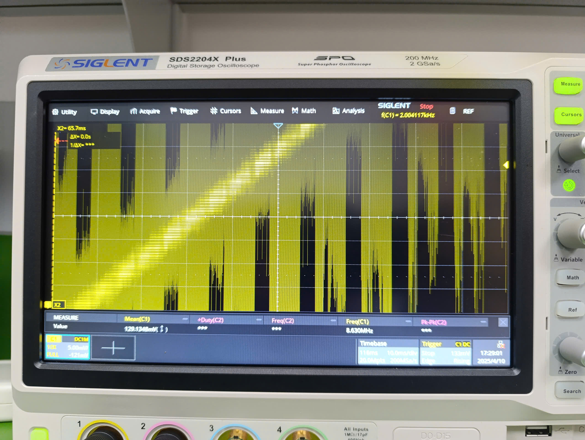
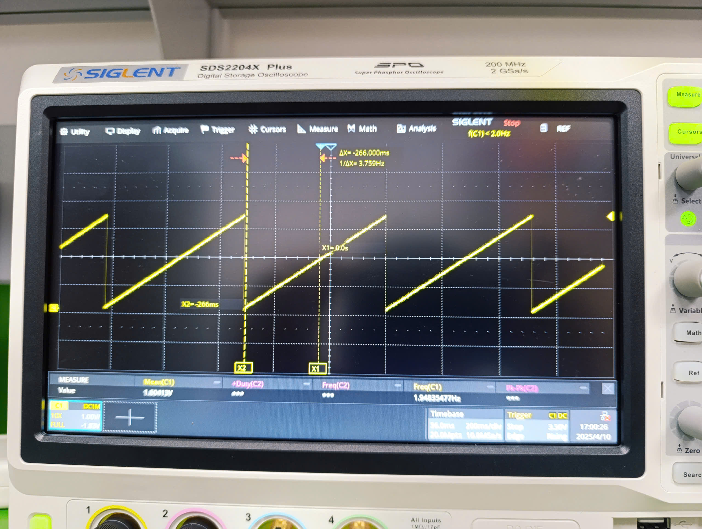

# ti_mspm0_DAC
[Example] Playground for testing DAC function of MSPM0G3507, or TI MCUs in general

## How to use
This is a copy from CCS example dac12_fifo_timer_event with a small modification is that resolution is 1 step increment instead of 8.

To use this, one can fetch from the forementioned example or build this example with CCS Theia (1.7.0).

## Experience evaluation
### Resolution
The resolution is suprisingly smooth

### Additional Information
